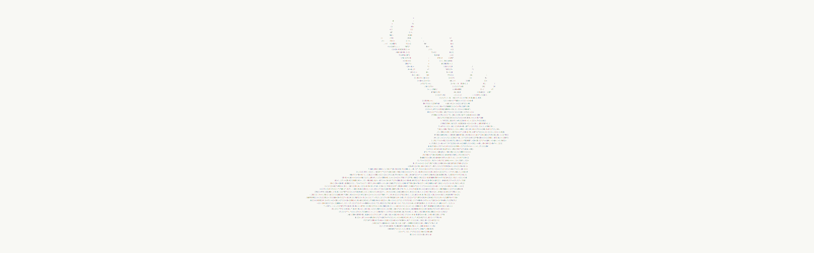

<p align="center">
  
</p>

# Omarchy Dazzle Dawn Theme

An Omarchy theme for bright terminals, crisp contrast, and daylight focus. Dazzle Dawn keeps the same electric Dazzle palette as Dusk, then turns the room white: black ink, cyan glass, berry highlights, and warm amber punctuation.

## Install

```sh
omarchy-theme-install https://github.com/csfh/omarchy-dazzle-dawn-theme
```

You can also install it from the Omarchy menu with `Super + Alt + Space`, then `Install > Style > Theme`, using this repository URL:

```text
https://github.com/csfh/omarchy-dazzle-dawn-theme
```

## Palette

| Role | Hex |
| --- | --- |
| Background | `#ffffff` |
| Foreground | `#1c1c1c` |
| Accent | `#00afd7` |
| Red | `#d75f87` |
| Green | `#5faf5f` |
| Yellow | `#d78700` |
| Magenta | `#af5fd7` |
| Cyan | `#00afaf` |

## Included

Desktop, terminal, editor, launcher, notification, bar, lock screen, browser, Discord, and TUI theme files for Omarchy:

`alacritty`, `btop`, `chromium`, `foot`, `ghostty`, `gtk`, `hyprland`, `hyprlock`, `kitty`, `mako`, `neovim`, `swayosd`, `vencord`, `vscode`, `walker`, `warp`, `waybar`, `wofi`, and `zellij`.

## Pairing

Dawn is the light counterpart to [Dazzle Dusk](https://github.com/csfh/omarchy-dazzle-dusk-theme). Use Dawn when you want the Dazzle color system in a paper-bright workspace.

## Backgrounds

`omarchy-buck-light` is the theme stag.

The other wallpapers are photographs on [Unsplash](https://unsplash.com), used under the [Unsplash License](https://unsplash.com/license):

- [`gold-pass`](backgrounds/gold-pass.webp) by [Christof Grossfurtner](https://unsplash.com/photos/a-man-standing-on-top-of-a-lush-green-hillside-2KCJU2t6Afc)
- [`rose-alpenglow`](backgrounds/rose-alpenglow.jpg) by [Marek Piwnicki](https://unsplash.com/@marekpiwnicki) ([photo](https://unsplash.com/photos/snow-covered-mountain-under-blue-sky-during-daytime-DgdJ_0us5SE))

## License

MIT. See [LICENSE](LICENSE). Copyright (c) 2026 Christoffer Hallas.

Unsplash photographs remain the work of their authors under the Unsplash License.

If you send a pull request or other contribution, you agree to the [CLA](CLA.md).
